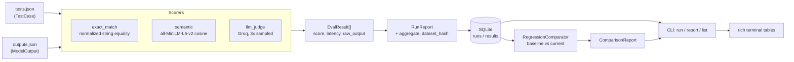

# EvalForge

EvalForge is a general-purpose eval harness for LLM outputs. You define test cases as plain JSON, bring your model's outputs, and score them with any combination of three methods — exact match, local semantic similarity, and an LLM-as-judge backed by the Groq API — then persist every run to SQLite so you can compare runs over time. The point is the last part: a single eval score tells you very little, but the same dataset scored before and after a prompt change tells you whether you broke something. EvalForge flags per-test-case regressions between any two runs, and because LLM judges are themselves noisy, it calls the judge multiple times per case and reports the spread rather than pretending a single sample is ground truth.

## Architecture



## Installation

Requires Python 3.13+.

```bash
git clone <your-repo-url>
cd EvalForge
uv sync
```

Or with pip:

```bash
pip install -e .
```

The `semantic` scorer downloads the `all-MiniLM-L6-v2` model (~80 MB) to your Hugging Face cache on first use, then runs locally with no network calls and no cost.

The `llm_judge` scorer needs a [Groq API key](https://console.groq.com):

```bash
export GROQ_API_KEY="gsk_..."          # macOS/Linux
$env:GROQ_API_KEY = "gsk_..."          # PowerShell
```

The other two scorers need no key, so you can use EvalForge entirely offline if you skip `llm_judge`.

## Usage

The `examples/` folder contains a working dataset plus two sets of model outputs — the second with deliberately worse answers on two test cases — so you can see regression detection fire immediately.

Score the first set of outputs:

```bash
evalforge run \
  --dataset examples/tests.json \
  --outputs examples/outputs.json \
  --scorers exact_match,semantic \
  --run-id demo-v1
```

```
Aggregate
+----------------------------------+
| Method      | Mean score | Cases |
|-------------+------------+-------|
| exact_match |      0.667 |     6 |
| semantic    |      0.979 |     6 |
+----------------------------------+
```

Score the degraded set:

```bash
evalforge run \
  --dataset examples/tests.json \
  --outputs examples/outputs_v2.json \
  --scorers exact_match,semantic \
  --run-id demo-v2
```

Compare them:

```bash
evalforge compare --baseline demo-v1 --current demo-v2
```

```
Regressions
+--------------------------------------------------------------------+
| Test case              | Method      | Baseline | Current |  Delta |
|------------------------+-------------+----------+---------+--------|
| capital-france         | exact_match |    1.000 |   0.000 | -1.000 |
| capital-france         | semantic    |    1.000 |   0.497 | -0.503 |
| explain-photosynthesis | semantic    |    0.951 |   0.645 | -0.306 |
+--------------------------------------------------------------------+
3 regression(s) out of 12 compared.
```

Browse history and re-print any past run without re-scoring:

```bash
evalforge list
evalforge report --run-id demo-v1
```

To include the LLM judge (requires `GROQ_API_KEY`):

```bash
evalforge run \
  --dataset examples/tests.json \
  --outputs examples/outputs.json \
  --scorers exact_match,semantic,llm_judge \
  --run-id demo-judged
```

### Commands

| Command | Purpose |
| --- | --- |
| `run` | Score outputs against a dataset and save the run |
| `compare` | Flag per-case regressions between two saved runs |
| `list` | List saved runs, newest first |
| `report` | Re-print a saved run's per-case and aggregate tables |

Common flags: `--db` (default `evalforge.db`) on every command; `--scorers` (default `exact_match`) and `--run-id` (auto-generated as `run-<timestamp>-<suffix>` if omitted) on `run`; `--threshold` (default `0.1`) on `compare`.

`compare` exits **1** when regressions are found and **0** when clean, so it can gate CI directly. Any error exits **2**.

### Input format

`tests.json` is a list of test cases; `reference` is optional and `metadata` is free-form:

```json
[
  {
    "id": "capital-france",
    "input": "What is the capital of France?",
    "reference": "Paris",
    "metadata": { "category": "factual" }
  }
]
```

`outputs.json` is a list of outputs matched to test cases by `test_case_id`:

```json
[
  { "test_case_id": "capital-france", "output": "Paris" }
]
```

Test cases with no matching output are skipped with a warning rather than failing the run.

### Scorers

| Name | What it measures | Cost |
| --- | --- | --- |
| `exact_match` | String equality after lowercasing and whitespace normalization. Binary 1.0 / 0.0. Also reports Jaccard token overlap in `raw_output` as a diagnostic, so near-misses are visible without affecting the score. | Free, instant |
| `semantic` | Cosine similarity between `all-MiniLM-L6-v2` embeddings of the reference and the output, clamped to `[0, 1]`. Catches correct answers phrased differently. | Free, local |
| `llm_judge` | A Groq-hosted model (`llama-3.3-70b-versatile`) grades the output against the input and reference on a 0–1 scale, sampled 3 times. | Groq API |

## The judge variance design decision

This is the most opinionated part of EvalForge, so it's worth explaining.

An LLM judge is a measurement instrument, and it is not a precise one. Ask a model to grade the same output twice and you can get 0.8 and 0.4 — not because the output changed, but because the judge is sampling from a distribution. A harness that calls the judge once and records the number presents a noisy sample as if it were a fact, and every downstream decision inherits that noise silently. Worse, in a regression-detection tool this noise is actively dangerous: a "regression" from 0.8 to 0.4 might be a genuine quality drop, or it might be the same output judged twice by a coin flip.

So EvalForge **calls the judge 3 times per test case** and records all three. Three is a deliberate compromise: one sample tells you nothing about spread, two tell you they disagree but not which is unusual, and beyond three you're paying linearly more API calls and latency for diminishing information about what is fundamentally a "should I trust this number?" question. Three is enough to compute a standard deviation that distinguishes a stable judgment from an unstable one, which is all the signal that's actually needed.

The score recorded is the **plain mean** of the three calls. When the standard deviation exceeds a threshold (default `0.15`), the result is flagged `high_variance` and surfaced in the report:

```
High-variance judge flags: 2 (reported only - scores are not adjusted)
```

Critically, **the flag changes nothing about the score**. EvalForge does not drop outliers, re-run until the samples agree, take the median, or otherwise "clean" the data. This is intentional. Every one of those corrections is a guess about which sample was wrong, and the harness has no basis for that guess — if the judge returns 0.1, 0.9, and 0.5, the honest reading is "this judge cannot evaluate this test case reliably," not "the answer is probably 0.5 and we should suppress the disagreement." Auto-correcting would produce a confident-looking number that hides exactly the information a user needs, and it would make the tool's output worse precisely on the cases where the tool is least reliable.

A high-variance flag is therefore a prompt for human attention. It usually means one of three things: the test case is genuinely ambiguous, the rubric is underspecified, or the output sits near a quality boundary the judge doesn't resolve consistently. All three are problems with your eval, not problems to be smoothed away by the harness — and all three are invisible if you only ever see a single sampled score.

Judge calls run at temperature 1.0 by design. Setting temperature to 0 would suppress the variance rather than measure it, producing consistent-looking scores that conceal the judge's actual uncertainty about the case.

Both the number of calls and the variance threshold are configurable on `LLMJudgeScorer` (`num_calls`, `variance_threshold`).

## Scope and limitations

- **EvalForge does not generate model outputs.** You bring your own `outputs.json`. It scores and tracks; running your model is your pipeline's job. This keeps the harness provider-agnostic — the outputs can come from any model, any API, or a human.
- **Comparisons assume the same dataset.** `compare` only evaluates `(test_case_id, method)` pairs present in both runs. If the dataset's content hash differs between runs, it warns but still compares the shared pairs; it also warns when pairs exist in only one run. It will not tell you whether a score changed because the model changed or because you edited the test case — keep the dataset fixed when you care about the answer.
- **Regression detection is per-case and threshold-based**, not statistical. A drop larger than `--threshold` is flagged; there's no significance testing across the dataset, and no aggregate-level regression detection.
- **A reference answer is required** for `exact_match` and `semantic`; both raise without one. `llm_judge` works without a reference, grading on correctness and quality alone.
- **Judge variance is measured, never acted on.** See above — flags are reported, scores are untouched.
- **Storage is a local SQLite file.** No concurrent-writer story, no remote backend, no migrations. Run IDs must be unique; re-using one is rejected.
- **Scores are not comparable across scorers.** A 0.9 from `semantic` and a 0.9 from `llm_judge` mean different things; compare each method against itself over time.

## Development

```bash
uv sync
uv run pytest
```

The suite covers schema validation, all three scorers, SQLite round-tripping, regression detection, and integration tests for every CLI command. No test calls the Groq API — the judge's client is constructor-injectable and mocked, including malformed-JSON and high-variance cases. The `semantic` tests do run the real local model, since it's free and offline.
